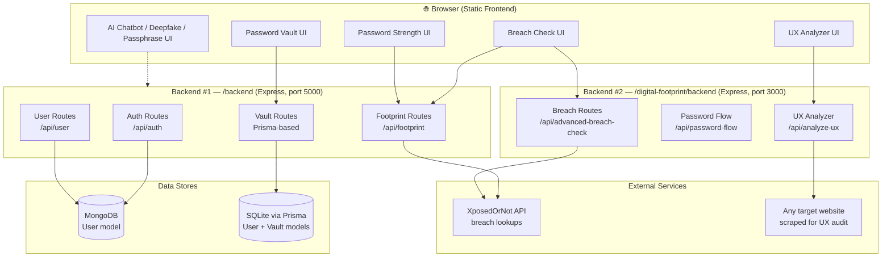
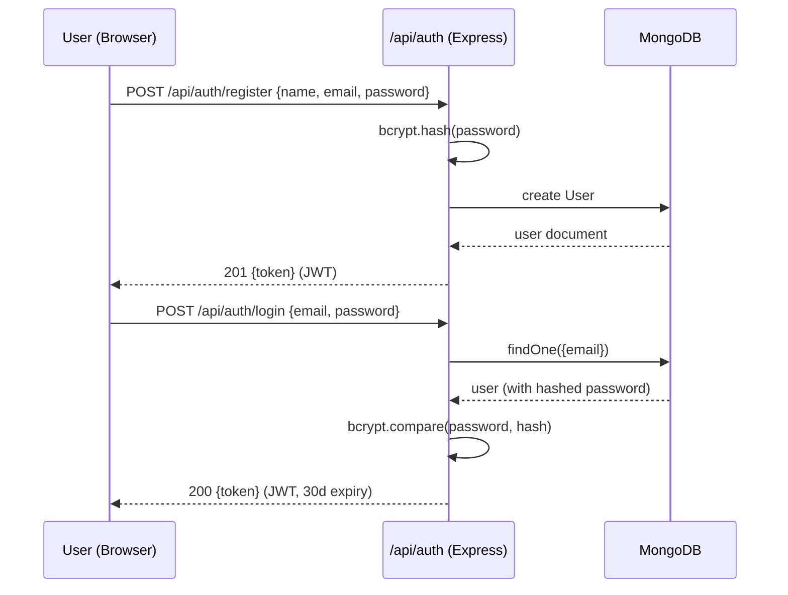
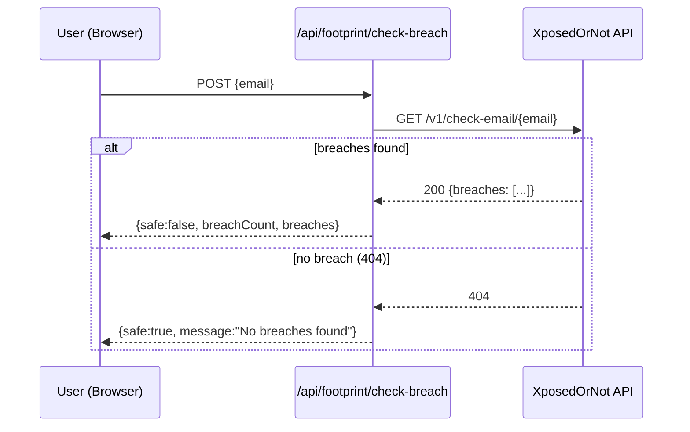
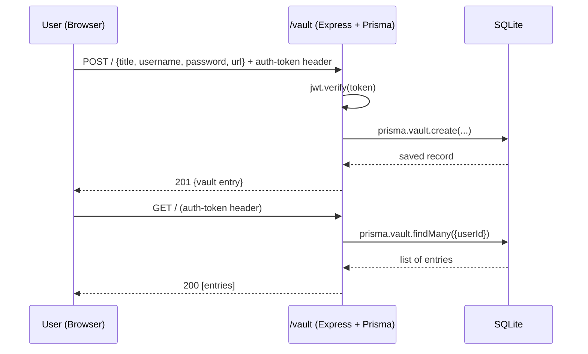

# 🛡️ Byte Warden

**Open-source password manager & digital-footprint protection suite.**

Byte Warden bundles a password vault, password-strength/UX analysis, data-breach checking, an AI security chatbot, a deepfake detector, and a passphrase generator into one project — a full-stack (HTML/CSS/JS front end + two Node/Express back ends) security toolkit.

> ⚠️ **Status:** This is a learning / portfolio-stage project. Several security shortcuts (noted in [Known Issues](#-known-issues--things-to-fix-before-production)) still need to be closed before this should hold real user passwords.

---

## 📑 Table of Contents

- [Features](#-features)
- [Tech Stack](#-tech-stack)
- [Architecture](#-architecture)
- [Folder Structure](#-folder-structure)
- [How It Works (Flows)](#-how-it-works-flows)
- [API Reference](#-api-reference)
- [Getting Started](#-getting-started)
- [Environment Variables](#-environment-variables)
- [Known Issues / Things to Fix Before Production](#-known-issues--things-to-fix-before-production)
- [Roadmap](#-roadmap)
- [Contributing](#-contributing)

---

## ✨ Features

| Module | Page | What it does |
|---|---|---|
| 🔐 Password Vault | `passwordvault.html` | Store, view, and delete saved credentials |
| 📊 Password Strength Analyzer | `password_strength.html` | Scores a password's entropy and gives improvement tips |
| 🕵️ Breach Checker | `breach_check.html` | Checks an email against known data breaches (via XposedOrNot API) |
| 🎭 Deepfake Detection | `deepfake.html` | Front-end flow for flagging manipulated media |
| 🔑 Passphrase Generator | `passphrase_generator.html` | Generates memorable, high-entropy passphrases |
| 🖥️ Password UX Analyzer | `ux_analyzer.html` | Scrapes a target site's login/signup form and grades its password-field UX (autocomplete, paste-blocking, maxlength, strength meter) |
| 🤖 AI Chatbot | `aichatbot.html` | Conversational security assistant |
| 👤 Auth | `login.html` | Register / log in with JWT-based sessions |

---

## 🧰 Tech Stack

**Frontend:** Plain HTML5, CSS3, JavaScript (no framework/build step) — one page per feature.

**Backend #1 — `/backend`** (primary API)
- Express.js, MongoDB + Mongoose (`User` model)
- JWT auth, bcrypt password hashing
- Helmet (secure headers), CORS, `express-rate-limit`
- A parallel **Prisma + SQLite** schema (`backend/prisma/schema.prisma`) plus standalone `auth.js` / `vault.js` route files, used for the vault feature

**Backend #2 — `/digital-footprint/backend`** (breach & UX tooling)
- Express.js, Axios, Cheerio (HTML scraping for the UX analyzer)
- Talks to the external **XposedOrNot** breach-check API
- Rate-limited endpoints for password generation, breach checks, and UX audits

---

## 🏗️ Architecture



Two backends exist because features were built incrementally: `/backend` (Mongo + Mongoose, and a second Prisma/SQLite path bolted on for the vault) started the project, and `/digital-footprint/backend` was added later for breach-checking and the UX analyzer. They currently run as **separate servers on separate ports** rather than one unified API — see [Known Issues](#-known-issues--things-to-fix-before-production).

---

## 📁 Folder Structure

```
byte-Warden--/
├── index.html, login.html, contact.html, ...      # Static marketing / auth pages
├── passwordvault.{html,css,js}                     # Vault UI
├── password_strength.{html,css,js}                 # Strength analyzer UI
├── breach_check.html                               # Breach checker UI
├── ux_analyzer.{html,js}                           # UX analyzer UI
├── passphrase_generator.{html,js}                  # Passphrase generator UI
├── deepfake.{html,css,js}                           # Deepfake detector UI
├── aichatbot.{html,css,js}                          # AI chatbot UI
│
├── backend/                                        # Primary API (Mongo + Prisma mix)
│   ├── server.js                                   # Express entry point
│   ├── config/db.js                                # MongoDB connection
│   ├── models/User.js                              # Mongoose User schema
│   ├── controllers/                                # authController, userController, footprintController
│   ├── routes/                                     # authRoutes, userRoutes, footprintRoutes, auth.js, vault.js
│   ├── middleware/                                 # authMiddleware (JWT guard), errorMiddleware
│   └── prisma/schema.prisma                        # SQLite schema for User + Vault
│
└── digital-footprint/
    ├── frontend/                                   # app.js / app.jsx / styles.css experiments
    └── backend/
        ├── server.js                               # Second Express entry point
        └── routes/
            ├── breachRoutes.js                     # /api/advanced-breach-check
            ├── passwordFlowRoutes.js                # /api/password-flow (generate/save)
            └── uxAnalyzerRoutes.js                  # /api/analyze-ux (Cheerio scraper)
```

---

## 🔄 How It Works (Flows)

### 1. User registration & login



### 2. Email breach check



### 3. Password UX audit (for developers checking their own site)

```mermaid
sequenceDiagram
    participant U as User (Browser)
    participant UX as /api/analyze-ux
    participant T as Target Website

    U->>UX: GET ?url=example.com
    UX->>T: GET (scrape HTML)
    T-->>UX: raw HTML
    UX->>UX: Cheerio: inspect <input type="password">
    Note over UX: Checks autocomplete, paste-blocking,<br/>maxlength, presence of a strength meter
    UX-->>U: {score, grade, passedChecks, failedChecks, fixes}
```



### 4. Vault: save & retrieve credentials



---

## 📡 API Reference

### Backend #1 — `/backend` (default port `5000`)

| Method | Endpoint | Auth | Description |
|---|---|---|---|
| POST | `/api/auth/register` | Public | Create account, returns JWT |
| POST | `/api/auth/login` | Public (rate-limited: 5/15min) | Log in, returns JWT |
| GET | `/api/user/profile` | JWT | Get current user profile |
| PUT | `/api/user/update` | JWT | Update current user profile |
| DELETE | `/api/user/delete` | JWT | Delete current user |
| POST | `/api/footprint/analyze-password` | Public | Score password strength |
| POST | `/api/footprint/check-breach` | Public | Check email against breach DB |

Standalone Prisma-based routes (`backend/routes/auth.js`, `backend/routes/vault.js`):

| Method | Endpoint | Auth | Description |
|---|---|---|---|
| POST | `/register` | Public | Register via Prisma/SQLite `User` |
| POST | `/login` | Public | Log in via Prisma/SQLite `User` |
| GET | `/` (vault) | `auth-token` header | List vault entries for user |
| POST | `/` (vault) | `auth-token` header | Add vault entry |
| DELETE | `/:id` (vault) | `auth-token` header | Delete vault entry |

### Backend #2 — `/digital-footprint/backend` (default port `3000`)

| Method | Endpoint | Rate limit | Description |
|---|---|---|---|
| POST | `/api/analyze-password` | — | Score password strength |
| POST | `/api/check-breach` | — | Check email (XposedOrNot, with fallback data) |
| GET | `/api/advanced-breach-check?email=` | 5/15min | Detailed breach list with mock logos |
| GET | `/api/password-flow/generate?length=` | — | Generate a high-entropy password |
| POST | `/api/password-flow/save` | — | Simulated vault save (no real persistence yet) |
| GET | `/api/analyze-ux?url=` | 20/5min | Scrape and grade a site's password UX |

---

## 🚀 Getting Started

### Prerequisites
- Node.js 18+
- MongoDB instance (local or Atlas) — for `/backend`
- npm

### 1. Clone
```bash
git clone https://github.com/prabalpratapsinghsisodiya01-art/byte-Warden--.git
cd byte-Warden--
```

### 2. Run Backend #1 (`/backend`)
```bash
cd backend
npm install
# create a .env file (see Environment Variables below)
npm run dev        # nodemon, or: npm start
```

### 3. Set up the Prisma/SQLite side (if using the vault routes)
```bash
cd backend
npx prisma generate
npx prisma migrate dev --name init
```

### 4. Run Backend #2 (`/digital-footprint/backend`)
```bash
cd digital-footprint/backend
npm install
npm run dev
```

### 5. Open the frontend
The HTML pages are static — open `index.html` directly in a browser, or serve the repo root with any static file server (e.g. `npx serve .`) so relative asset paths resolve correctly.

---

## 🔑 Environment Variables

Create a `.env` inside `/backend`:

```env
NODE_ENV=development
PORT=5000
MONGO_URI=mongodb://localhost:27017/bytewarden
JWT_SECRET=replace_with_a_long_random_string
JWT_EXPIRE=30d
TOKEN_SECRET=replace_with_another_long_random_string   # used by the Prisma auth.js/vault.js routes
```

`/digital-footprint/backend` doesn't currently require a `.env` to run, but `PORT` can be set to override the default `3000`.

---

## ⚠️ Known Issues / Things to Fix Before Production

These are worth addressing before this project handles real credentials:

- **Two parallel data layers.** `/backend` mixes Mongoose/MongoDB (`User` model) with a separate Prisma/SQLite schema for the vault. Pick one persistence layer and migrate fully.
- **Vault passwords stored in plaintext.** `backend/prisma/schema.prisma` and `backend/routes/vault.js` both flag this in comments — vault entries should be encrypted client-side (e.g. with the user's master password) before they ever reach the server.
- **Hardcoded fallback secrets.** `auth.js` and `vault.js` fall back to the literal string `'secret'` if `TOKEN_SECRET` isn't set. This should fail closed (refuse to start) instead of silently using a weak default.
- **Delete-vault-entry route doesn't scope by user.** The `userId` ownership check in `DELETE /vault/:id` is commented out, so any authenticated user could delete another user's entry by ID.
- **CORS wide open.** `digital-footprint/backend/server.js` sets `origin: '*'` — fine for local dev, should be locked to your real frontend origin in production.
- **Breach-check fallback returns fake "Canva" data** on API errors, which is good for a demo but should be clearly flagged (or removed) so it's never mistaken for a real result.
- **Two servers, two ports.** Consider merging both Express apps behind a single gateway/reverse proxy, or clearly documenting that both must run simultaneously.

---

## 🗺️ Roadmap

- [ ] Unify the two backends and the two persistence layers
- [ ] Client-side (zero-knowledge) encryption for vault entries
- [ ] Real authentication guard on `/password-flow/save`
- [ ] Automated tests for password-strength and breach-check logic
- [ ] Dockerize both backends for one-command local setup

---

## 🤝 Contributing

Issues and PRs are welcome. If you're fixing one of the items in [Known Issues](#-known-issues--things-to-fix-before-production), please call it out explicitly in your PR description so it's easy to review against the security concern it addresses.
